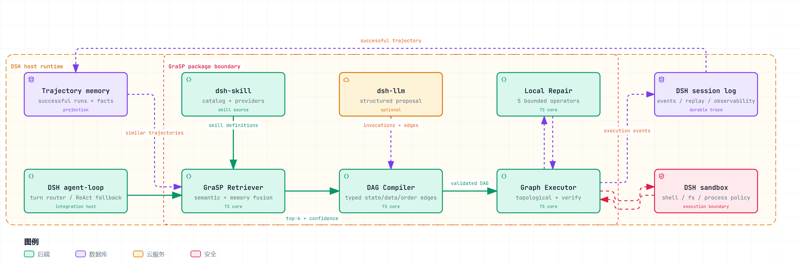
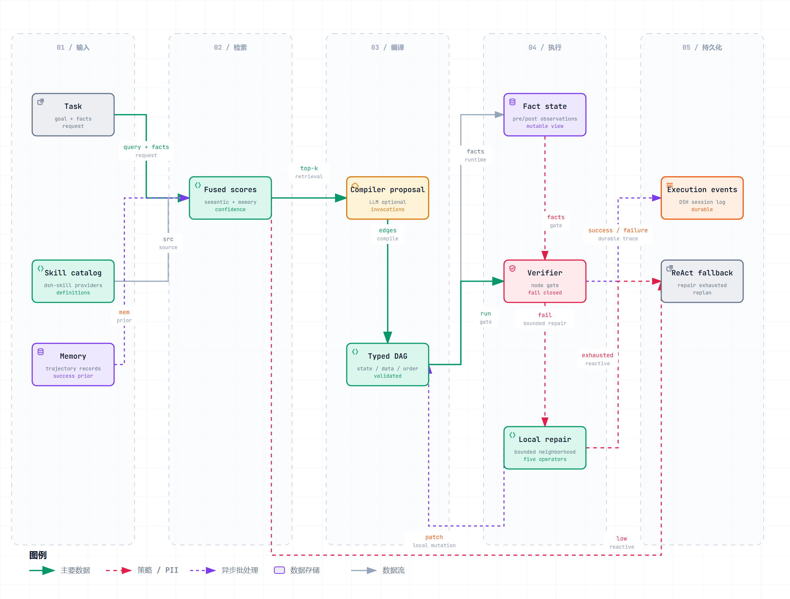

# dsh-elian
dsh-elian是基于dsh二开的新的功能特性包和插件包, 功能特性代码位于packages, 插件位于plugin下. 导入dsh即可直接使用.

## 仓库结构

| 路径 | 内容 |
| --- | --- |
| `packages/skill/grasp` | GraSP 核心库 `@deepseek-ai/dsh-skill-grasp`：技能检索、DAG 编译、验证执行、局部修复、置信度路由 |
| `plugins/grasp` | GraSP 演示插件：把核心库接进 dsh，注册模型可见的 `grasp` 工具 |
| `docs/grasp` | GraSP 设计文档（中英双语）、架构图与数据流图；`docs/grasp/diagrams` 是图的可编辑 JSON 源 |
| `plugins/DEBUGGING.md` | dsh web 的 VS Code attach 调试手册 |

-----

## GraSP：技能图编排

GraSP 在「技能检索」和「技能执行」之间加了一个编译阶段：先把少量候选技能实例化成带 `state`、`data`、`order` 三类依赖边的有向无环图（DAG），再按依赖执行、逐节点验证，失败时只在局部子图内做有界修复；检索置信度过低时直接回退 ReAct。它要解决的不是「缺少技能」，而是技能变多之后，选哪些、怎么排、结果可不可信、失败要重做多少，仍然由一次模型推理隐式承担的问题。

### 已导入的两个部分

| 位置 | 形态 | 职责 |
| --- | --- | --- |
| [`packages/skill/grasp`](packages/skill/grasp/README.zh.md)（[English](packages/skill/grasp/README.md)） | 纯 TypeScript 库，不依赖 Cordis、文件系统、进程执行或任何 LLM | `retrieveSkills()` 记忆条件检索、`compileSkillGraph()` 带类型边的 DAG 编译、`executeSkillGraph()` 拓扑执行与前置/后置验证、`repairSkillGraph()` 五类局部修复、`routeByConfidence()` 置信度路由，以及图、事件与预算类型 |
| [`plugins/grasp`](plugins/grasp/index.ts) | dsh 插件 + overlay | 补齐核心库留给宿主的四类适配（技能目录、经验记忆、执行上下文、修复预算），注册 `grasp` 工具，用工作区巡检技能跑通检索 → 编译 → 执行 → 验证 → 修复全链路；逐帧停点见 [GraSP 生命周期](plugins/grasp/README.md) |

核心库刻意保持框架无关：DSH 适配层负责提供技能定义、LLM 编译提案、会话事件和真实工具执行器，算法核心不需要改动。

### 挂载与运行

插件通过 overlay patch 插入 dsh profile，默认不影响任何已有 profile：

```powershell
pnpm dsh web --patch ./plugins/grasp/overlay.yml
```

需要在 VS Code 里断点调试时（`--patch` 是 launcher flag，必须写在 `--no-open` 这类 app flag 之前）：

```powershell
node --inspect=9229 --import tsx/esm apps/cli/src/bin.ts web --patch ./plugins/grasp/overlay.yml --no-open
```

overlay 默认配置为 `enabled: true`、`topK: 8`、`maxHops: 2`、`maxAttempts: 3`。

### 模型可见的 `grasp` 工具

| 参数 | 取值 | 说明 |
| --- | --- | --- |
| `action` | `retrieve` / `plan` / `run` | 只看检索分数 / 只编译 DAG 不执行 / 执行整图并做节点验证与局部修复 |
| `task` | 字符串 | 检索与编译所依据的任务描述 |
| `scenario` | `happy`（默认）/ `missing-precondition` / `verify-failure` | 演示用的故障注入场景 |

返回结果固定包含 `route`、`confidence`、`selected`、`order`、`ok`、`completed`、`events`、`artifacts`、`graph`，失败时附带 `error`。

| 场景 | 注入的故障 | 观察点 |
| --- | --- | --- |
| `happy` | 无 | `workspace.scan → workspace.metadata → deps.count → report.compose` 依次执行，`ok: true`，`artifacts.report` 有正文 |
| `missing-precondition` | 追加 `report.publish`，其前置 `review-approved` 在目录里无人产出 | 走到修复阶段；当前五类算子都无法补出该前置，报 `repaired=false` |
| `verify-failure` | `report.compose` 产出空正文 | 节点执行成功但后置验证失败，停在后置校验路径 |

### 设计文档与图

| 文档 | 内容 |
| --- | --- |
| [GraSP 核心设计与 DSH 适配路线](docs/grasp/core-design.zh.md)（[English](docs/grasp/core-design.md)） | 动机、论文方法（四阶段主链路、图模型、五类修复）、DSH 可复用能力与待补差距、目标架构（`grasp` / `grasp-basic` / `tool-grasp`）、运行流程、数据与接口、故障处理、阶段 0–4 适配路线、验收评测与风险 |
| [GraSP 生命周期](plugins/grasp/README.md) | 14 个停点：从插件 `apply()`、`retrieveSkills()`、`compileSkillGraph()`、`validateSkillGraph()` 直到五类修复算子 |
| [调试手册](plugins/DEBUGGING.md) | 用 VS Code attach 调试 dsh web、提示词组装和自研插件 |
| [图的 JSON 源](docs/grasp/diagrams) | 架构图与数据流图的作者文件，可改动后用 archify 重新渲染 |

两张图可以直接在浏览器打开（支持主题切换、视图聚焦、搜索与导出）：[架构图 HTML](docs/grasp/grasp-architecture.html) · [数据流图 HTML](docs/grasp/grasp-dataflow.html)。

[](docs/grasp/grasp-architecture.html)

[](docs/grasp/grasp-dataflow.html)

### 现状与边界

- `plugins/grasp` 是 overlay 显式开启的实验插件，默认 profile 不会启用 GraSP。
- 默认检索器是 token overlap，编译器的确定性回退按精确事实名推断 `state` 边，执行器按一次性拓扑顺序串行执行；生产接入应替换为 embedding 或模型检索、模型编译提案和动态 ready set。
- `reactive` 路由目前主要作为结果标签：低置信度时工具会返回该标记，但图仍会继续执行。
- 设计的运行时不等于已实现的运行时。`grasp-basic`、`tool-grasp`、Session 事件持久化和记忆投影都还在适配路线里，尚未落地。
- 本目录是 dsh 的增量包集合：示例命令里的 `pnpm dsh`、`apps/cli` 均指完整 dsh 仓库根目录。

### 开发备注

- `packages/skill/grasp` 的测试在 `tests/grasp.spec.ts`，需要在完整 dsh workspace 中运行。
- `docs/grasp` 的文档中英双语同等有效，改完任一侧后要同步另一侧，并重录 `docs/grasp/core-design.i18n.yaml` 里的 blob 哈希。
